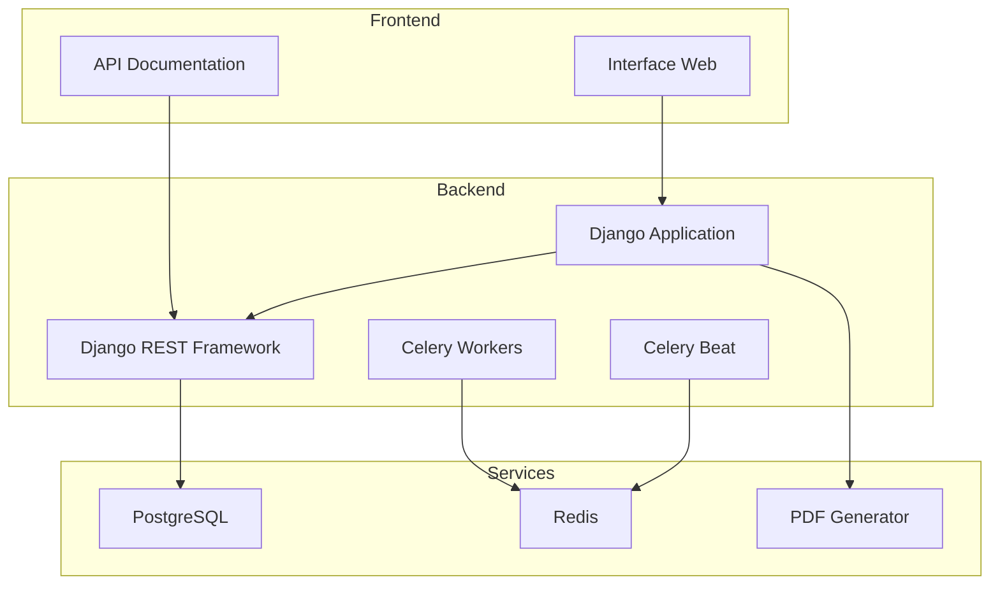
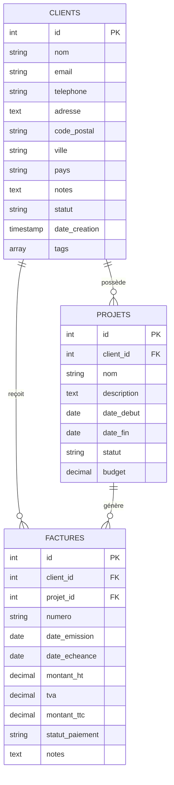
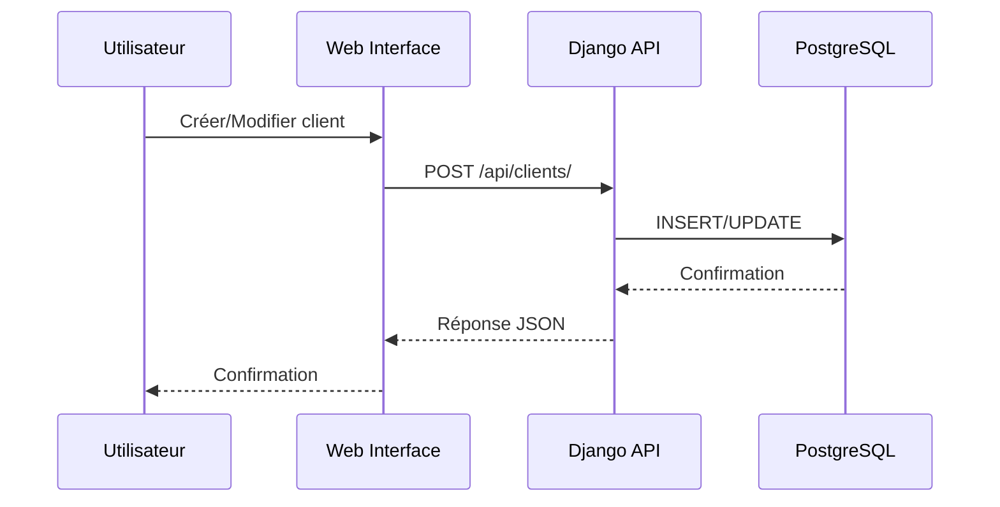
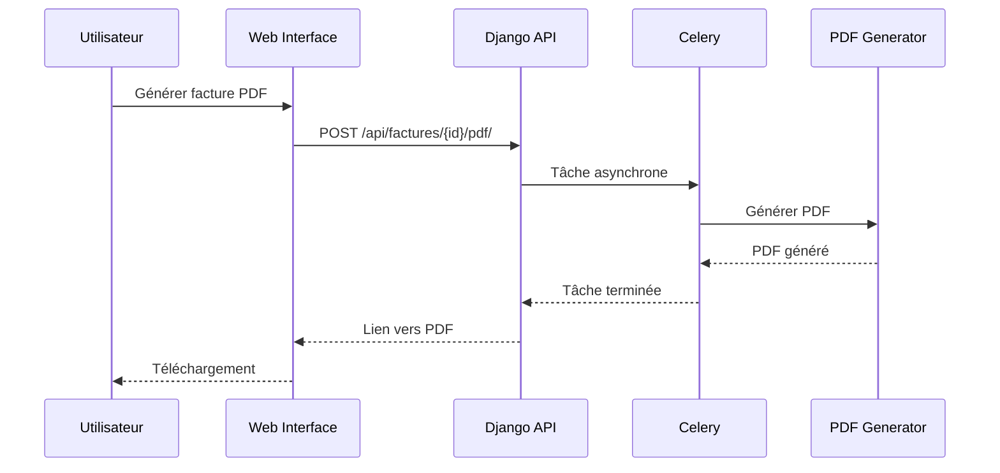
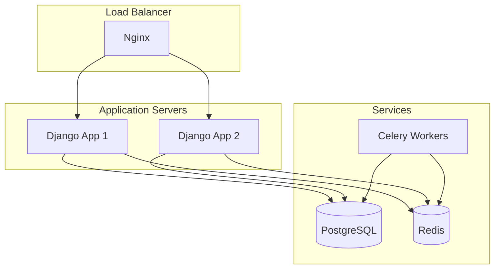

# Architecture du Mini CRM

## 🏗️ Vue d'ensemble

Le Mini CRM est une application web moderne construite avec Django, utilisant une architecture microservices conteneurisée.

## 📊 Architecture système



## 🗄️ Modèle de données



## 🔄 Flux de données

### 1. Gestion des clients



### 2. Génération de factures



## 🚀 Déploiement

### Architecture de production



## 🔧 Technologies utilisées

| Composant          | Technologie           | Version |
| ------------------ | --------------------- | ------- |
| Framework Web      | Django                | 5.2+    |
| API                | Django REST Framework | 3.16+   |
| Base de données    | PostgreSQL            | 15+     |
| Cache/Broker       | Redis                 | 7+      |
| Tâches asynchrones | Celery                | 5.5+    |
| Conteneurisation   | Docker                | 20+     |
| Orchestration      | Docker Compose        | 2+      |
| Serveur WSGI       | Gunicorn              | 23+     |
| Génération PDF     | ReportLab             | 4.4+    |

## 📈 Métriques et monitoring

- **Performance** : Temps de réponse < 200ms
- **Disponibilité** : 99.9% uptime
- **Sécurité** : Authentification JWT, HTTPS obligatoire
- **Scalabilité** : Architecture horizontale possible

## Étapes suivantes

### 1. **Renommer les fichiers**

Assure-toi que tes screenshots sont nommés comme dans le README :

- `dashboard.png`
- `clients.png`
- `factures.png`
- `api-docs.png`
- `demo.gif` (si tu as fait le GIF)

### 2. **Les placer dans le bon dossier**

Déplace tous tes screenshots dans le dossier `docs/` :

```
docs/
├── dashboard.png
├── clients.png
├── factures.png
├── api-docs.png
└── demo.gif
```

### 3. **Vérifier que les images s'affichent**

Le README est déjà configuré pour afficher :

```markdown
<code_block_to_apply_changes_from>


```

### 4. **Prochaine étape : Démo en ligne**

Maintenant on peut passer au déploiement sur Render pour avoir une démo live !

Tu veux qu'on :

1. **Organise d'abord les screenshots** dans le dossier `docs/` ?
2. **Ou on passe directement au déploiement** de la démo en ligne ?

Qu'est-ce que tu préfères ? 🚀
